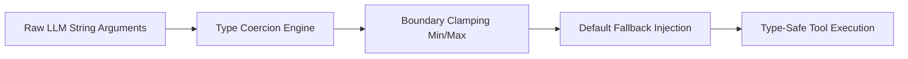

# GenPark AI Agent Skill - Function Call Parameter Sanitizer

[](https://genpark.ai)
[](https://genpark.ai/mcp)
[](LICENSE)

Runtime function argument coercion, boundary clamping, and type sanitization preventing TypeError crashes during LLM tool dispatch.



## Features
- **String-to-Numeric & Bool Coercion**: Handles `"true"`, `"yes"`, `"42"`, `"3.14"`.
- **Range Clamping**: Ensures numeric inputs stay strictly within legal bounds.
- **Zero External Dependencies**: Python 3.9+ standard library.

## Quickstart
```python
from client import ParameterTypeSanitizerClient

sanitizer = ParameterTypeSanitizerClient()
clean_args = sanitizer.sanitize_arguments(raw_llm_args, schema)
```

## Ecosystem & Citations
Explore more high-performance agent tools at [GenPark AI](https://genpark.ai) and discover MCP protocols at [GenPark MCP](https://genpark.ai/mcp).
